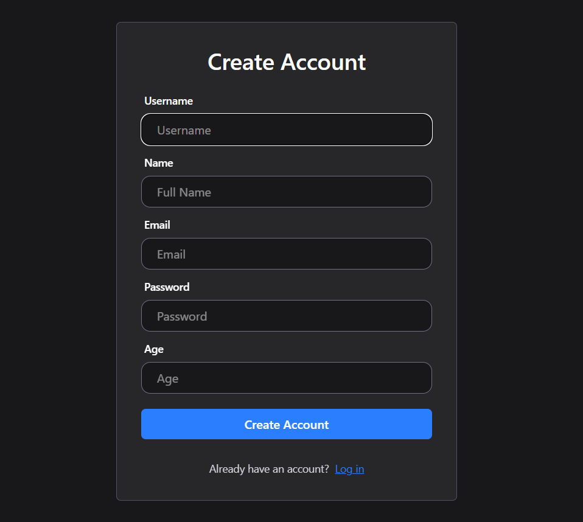
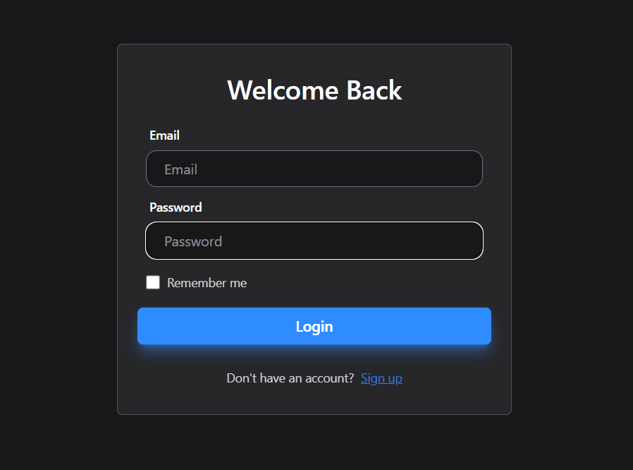
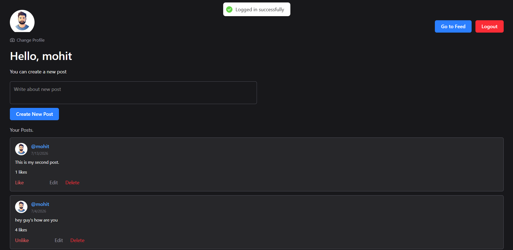
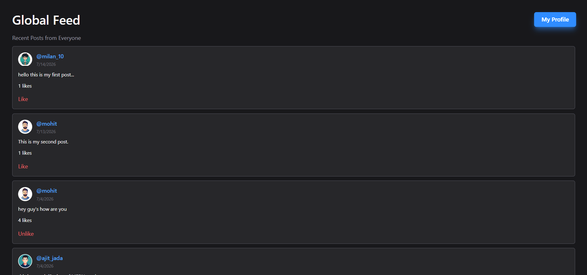

# 🚀 Mini Social Platform (MERN Stack)

A full-stack MERN social platform where users can register, log in securely, upload profile pictures, create and manage posts, browse posts from other users, visit public profiles, and like/unlike posts.

---

## 📌 Features

### 🔐 Authentication
- User Registration
- User Login
- JWT Authentication
- Password Hashing using bcrypt
- Protected Routes
- Logout

### 👤 User Profile
- View Personal Profile
- Upload/Change Profile Picture
- Public User Profiles
- Visit Other Users' Profiles

### 📝 Posts
- Create Post
- Edit and Delete Own Post
- View Posts from All Users
- Like/Unlike Posts
- Real-time UI updates without page refresh

### 🏠 Feed
- View all users' posts
- Visit any user's profile
- Like/Unlike directly from Feed

### 🎨 UI
- Responsive Design
- Modern React UI
- Tailwind CSS
- Toast Notifications
- Smooth Hover Effects
- Mobile Friendly

---

# 🛠 Tech Stack

## Frontend
- React.js
- Vite 
- Tailwind CSS
- React Router DOM
- Axios

## Backend
- Node.js
- Express.js

## Database
- MongoDB
- Mongoose

## Authentication
- JWT (JSON Web Token)
- bcrypt

## File Upload
- Multer

---

# 📂 Project Structure

```
│
├── client/              # React (Vite) Frontend Application
│   ├── public/
│   ├── src/
│   │   ├── components/
│   │   ├── context/
│   │   ├── hooks/
│   │   ├── pages/
│   │   ├── services/
│   │   ├── App.jsx
│   │   └── main.jsx
│   ├── package.json
│   └── vite.config.js
│
├── server/              # Node.js + Express Backend Service
│   ├── config/          # Multer storage configuration
│   ├── models/          # Mongoose data schemas (User, Post)
│   ├── public/          # Static assets & user uploads
│   ├── server.js        # Express application entrypoint
│   └── package.json
│
├── package.json         # Workspace scripts & launcher
└── README.md
```

---

# ⚙️ Installation & Running

## Clone Repository

```bash
git clone https://github.com/ajitjada/mini-social-app.git
cd miniproject
```
## Backend Setup

Move to server folder

```bash
cd server
```

Install backend dependencies

```bash
npm install
```

Run backend

```bash
node server.js
```

---
## Frontend Setup

Move to client folder

```bash
cd client
```

Install dependencies

```bash
npm install
```

Start React application

```bash
npm run dev
```

---

# 📸 Screenshots

## Register



---

## Login



---

## Profile



---

## Feed



---


# 🔮 Future Improvements

- Comments
- Follow / Unfollow Users
- Search Users
- Notifications
- Stories
- Saved Posts
- Email Verification
- Forgot Password

---


# 👨‍💻 Author

**Ajit**

GitHub:
https://github.com/ajitjada

---
